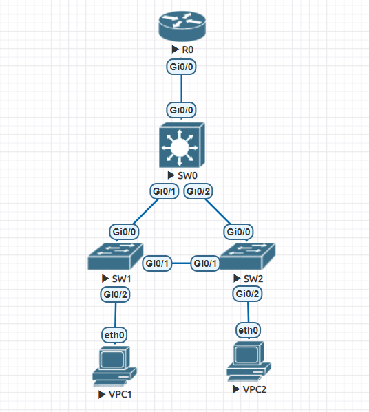

# ЛР-1. Реализация небольшой сети офиса

## Топология




## Процесс настройки системы

### 1. Настроим виртуальные клиентские устройства.

#### VPC1

  ```
  set pcname VPC1
  ip 10.0.10.2/24 10.0.10.1
  write memory
  ```

#### VPC2

  ```
  set pcname VPC2
  ip 10.0.20.2/24 10.0.20.1
  write memory
  ```

### 2. Настроим Маршрутизатор.

#### R0

  ```
  enable
    configure terminal
        interface gi 0/0
          no shutdown
          exit

        interface gi 0/0.10
            encapsulation dot1Q 10
            ip address 10.0.10.1 255.255.255.0
            exit
        interface gi 0/0.20
            encapsulation dot1q 20
            ip address 10.0.20.1 255.255.255.0
            exit
        exit
    copy run start
  ```

### 3. Настроим Коммутаторы.

#### SW0

  ```
  enable
    configure terminal
        hostname SW0
        vlan 10
            exit
        vlan 20
            exit
        interface range gi 0/0-2
            switchport trunk encapsulation dot1q
            switchport mode trunk
            switchport trunk allowed vlan 10,20
            exit
        spanning-tree vlan 10 root primary
        spanning-tree vlan 20 root primary
        exit
    copy run start
  ```

#### SW1

  ```
  enable
    configure terminal
        hostname SW1
        vlan 10
            exit
        vlan 20
            exit
        interface gi 0/2
            switchport mode access
            switchport access vlan 10
            exit
        interface range gi 0/0-1
            switchport trunk encapsulation dot1q
            switchport mode trunk
            switchport trunk allowed vlan 10,20
            exit
        exit
     copy run start
  ```

#### SW2

  ```
  enable
    configure terminal
        hostname SW1
        vlan 10
            exit
        vlan 20
            exit
        interface gi 0/2
            switchport mode access
            switchport access vlan 20
            exit
        interface range gi 0/0-1
            switchport trunk encapsulation dot1q
            switchport mode trunk
            switchport trunk allowed vlan 10,20
            exit
        exit
     copy run start
  ```

## Проверка

### Выводы по *spanning-tree* от коммутаторов

#### SW0

  ```
  SW0#show spanning-tree

VLAN0001
  Spanning tree enabled protocol ieee
  Root ID    Priority    32769
             Address     5000.0002.0000
             This bridge is the root
             Hello Time   2 sec  Max Age 20 sec  Forward Delay 15 sec

  Bridge ID  Priority    32769  (priority 32768 sys-id-ext 1)
             Address     5000.0002.0000
             Hello Time   2 sec  Max Age 20 sec  Forward Delay 15 sec
             Aging Time  300 sec

Interface           Role Sts Cost      Prio.Nbr Type
------------------- ---- --- --------- -------- --------------------------------
Gi0/3               Desg FWD 4         128.4    P2p
Gi1/0               Desg FWD 4         128.5    P2p
Gi1/1               Desg FWD 4         128.6    P2p
Gi1/2               Desg FWD 4         128.7    P2p
Gi1/3               Desg FWD 4         128.8    P2p


VLAN0010
  Spanning tree enabled protocol ieee
  Root ID    Priority    24586
             Address     5000.0002.0000
             This bridge is the root
             Hello Time   2 sec  Max Age 20 sec  Forward Delay 15 sec

  Bridge ID  Priority    24586  (priority 24576 sys-id-ext 10)
             Address     5000.0002.0000
             Hello Time   2 sec  Max Age 20 sec  Forward Delay 15 sec
             Aging Time  300 sec

Interface           Role Sts Cost      Prio.Nbr Type
------------------- ---- --- --------- -------- --------------------------------
Gi0/0               Desg FWD 4         128.1    P2p
Gi0/1               Desg FWD 4         128.2    P2p
Gi0/2               Desg FWD 4         128.3    P2p


VLAN0020
  Spanning tree enabled protocol ieee
  Root ID    Priority    24596
             Address     5000.0002.0000
             This bridge is the root
             Hello Time   2 sec  Max Age 20 sec  Forward Delay 15 sec

  Bridge ID  Priority    24596  (priority 24576 sys-id-ext 20)
             Address     5000.0002.0000
             Hello Time   2 sec  Max Age 20 sec  Forward Delay 15 sec
             Aging Time  300 sec

Interface           Role Sts Cost      Prio.Nbr Type
------------------- ---- --- --------- -------- --------------------------------
Gi0/0               Desg FWD 4         128.1    P2p
Gi0/1               Desg FWD 4         128.2    P2p
Gi0/2               Desg FWD 4         128.3    P2p
  ```

#### SW1

```
SW1#show spanning-tree

VLAN0001
  Spanning tree enabled protocol ieee
  Root ID    Priority    32769
             Address     5000.0004.0000
             This bridge is the root
             Hello Time   2 sec  Max Age 20 sec  Forward Delay 15 sec

  Bridge ID  Priority    32769  (priority 32768 sys-id-ext 1)
             Address     5000.0004.0000
             Hello Time   2 sec  Max Age 20 sec  Forward Delay 15 sec
             Aging Time  300 sec

Interface           Role Sts Cost      Prio.Nbr Type
------------------- ---- --- --------- -------- --------------------------------
Gi0/3               Desg FWD 4         128.4    P2p
Gi1/0               Desg FWD 4         128.5    P2p
Gi1/1               Desg FWD 4         128.6    P2p
Gi1/2               Desg FWD 4         128.7    P2p
Gi1/3               Desg FWD 4         128.8    P2p


VLAN0010
  Spanning tree enabled protocol ieee
  Root ID    Priority    24586
             Address     5000.0002.0000
             Cost        4
             Port        1 (GigabitEthernet0/0)
             Hello Time   2 sec  Max Age 20 sec  Forward Delay 15 sec

  Bridge ID  Priority    32778  (priority 32768 sys-id-ext 10)
             Address     5000.0004.0000
             Hello Time   2 sec  Max Age 20 sec  Forward Delay 15 sec
             Aging Time  300 sec

Interface           Role Sts Cost      Prio.Nbr Type
------------------- ---- --- --------- -------- --------------------------------
Gi0/0               Root FWD 4         128.1    P2p
Gi0/1               Altn BLK 4         128.2    P2p
Gi0/2               Desg FWD 4         128.3    P2p


VLAN0020
  Spanning tree enabled protocol ieee
  Root ID    Priority    24596
             Address     5000.0002.0000
             Cost        4
             Port        1 (GigabitEthernet0/0)
             Hello Time   2 sec  Max Age 20 sec  Forward Delay 15 sec

  Bridge ID  Priority    32788  (priority 32768 sys-id-ext 20)
             Address     5000.0004.0000
             Hello Time   2 sec  Max Age 20 sec  Forward Delay 15 sec
             Aging Time  300 sec

Interface           Role Sts Cost      Prio.Nbr Type
------------------- ---- --- --------- -------- --------------------------------
Gi0/0               Root FWD 4         128.1    P2p
Gi0/1               Altn BLK 4         128.2    P2p
```

#### SW2

```
SW2#show spa

VLAN0001
  Spanning tree enabled protocol ieee
  Root ID    Priority    32769
             Address     5000.0003.0000
             This bridge is the root
             Hello Time   2 sec  Max Age 20 sec  Forward Delay 15 sec

  Bridge ID  Priority    32769  (priority 32768 sys-id-ext 1)
             Address     5000.0003.0000
             Hello Time   2 sec  Max Age 20 sec  Forward Delay 15 sec
             Aging Time  300 sec

Interface           Role Sts Cost      Prio.Nbr Type
------------------- ---- --- --------- -------- --------------------------------
Gi0/3               Desg FWD 4         128.4    P2p
Gi1/0               Desg FWD 4         128.5    P2p
Gi1/1               Desg FWD 4         128.6    P2p
Gi1/2               Desg FWD 4         128.7    P2p
Gi1/3               Desg FWD 4         128.8    P2p


VLAN0010
  Spanning tree enabled protocol ieee
  Root ID    Priority    24586
             Address     5000.0002.0000
             Cost        4
             Port        1 (GigabitEthernet0/0)
             Hello Time   2 sec  Max Age 20 sec  Forward Delay 15 sec

  Bridge ID  Priority    32778  (priority 32768 sys-id-ext 10)
             Address     5000.0003.0000
             Hello Time   2 sec  Max Age 20 sec  Forward Delay 15 sec
             Aging Time  300 sec

Interface           Role Sts Cost      Prio.Nbr Type
------------------- ---- --- --------- -------- --------------------------------
Gi0/0               Root FWD 4         128.1    P2p
Gi0/1               Desg FWD 4         128.2    P2p


VLAN0020
  Spanning tree enabled protocol ieee
  Root ID    Priority    24596
             Address     5000.0002.0000
             Cost        4
             Port        1 (GigabitEthernet0/0)
             Hello Time   2 sec  Max Age 20 sec  Forward Delay 15 sec

  Bridge ID  Priority    32788  (priority 32768 sys-id-ext 20)
             Address     5000.0003.0000
             Hello Time   2 sec  Max Age 20 sec  Forward Delay 15 sec
             Aging Time  300 sec

Interface           Role Sts Cost      Prio.Nbr Type
------------------- ---- --- --------- -------- --------------------------------
Gi0/0               Root FWD 4         128.1    P2p
Gi0/1               Desg FWD 4         128.2    P2p
Gi0/2               Desg FWD 4         128.3    P2p
```

Как видим, SW0 является корнем сети для обоих VLAN, а линк между SW1 и SW2 заблокирован

### Информация по *vlan*

#### SW0

```
SW0#show vlan

VLAN Name                             Status    Ports
---- -------------------------------- --------- -------------------------------
1    default                          active    Gi0/3, Gi1/0, Gi1/1, Gi1/2
                                                Gi1/3
10   VLAN0010                         active
20   VLAN0020                         active
1002 fddi-default                     act/unsup
1003 token-ring-default               act/unsup
1004 fddinet-default                  act/unsup
1005 trnet-default                    act/unsup

VLAN Type  SAID       MTU   Parent RingNo BridgeNo Stp  BrdgMode Trans1 Trans2
---- ----- ---------- ----- ------ ------ -------- ---- -------- ------ ------
1    enet  100001     1500  -      -      -        -    -        0      0
10   enet  100010     1500  -      -      -        -    -        0      0
20   enet  100020     1500  -      -      -        -    -        0      0
1002 fddi  101002     1500  -      -      -        -    -        0      0
1003 tr    101003     1500  -      -      -        -    -        0      0
1004 fdnet 101004     1500  -      -      -        ieee -        0      0
1005 trnet 101005     1500  -      -      -        ibm  -        0      0

Remote SPAN VLANs
------------------------------------------------------------------------------


Primary Secondary Type              Ports
------- --------- ----------------- ------------------------------------------
```

#### SW1

```
SW1#show vlan

VLAN Name                             Status    Ports
---- -------------------------------- --------- -------------------------------
1    default                          active    Gi0/3, Gi1/0, Gi1/1, Gi1/2
                                                Gi1/3
10   VLAN0010                         active    Gi0/2
20   VLAN0020                         active
1002 fddi-default                     act/unsup
1003 token-ring-default               act/unsup
1004 fddinet-default                  act/unsup
1005 trnet-default                    act/unsup

VLAN Type  SAID       MTU   Parent RingNo BridgeNo Stp  BrdgMode Trans1 Trans2
---- ----- ---------- ----- ------ ------ -------- ---- -------- ------ ------
1    enet  100001     1500  -      -      -        -    -        0      0
10   enet  100010     1500  -      -      -        -    -        0      0
20   enet  100020     1500  -      -      -        -    -        0      0
1002 fddi  101002     1500  -      -      -        -    -        0      0
1003 tr    101003     1500  -      -      -        -    -        0      0
1004 fdnet 101004     1500  -      -      -        ieee -        0      0
1005 trnet 101005     1500  -      -      -        ibm  -        0      0

Remote SPAN VLANs
------------------------------------------------------------------------------


Primary Secondary Type              Ports
------- --------- ----------------- ------------------------------------------
```

#### SW2

```
SW2#show vlan

VLAN Name                             Status    Ports
---- -------------------------------- --------- -------------------------------
1    default                          active    Gi0/3, Gi1/0, Gi1/1, Gi1/2
                                                Gi1/3
10   VLAN0010                         active
20   VLAN0020                         active    Gi0/2
1002 fddi-default                     act/unsup
1003 token-ring-default               act/unsup
1004 fddinet-default                  act/unsup
1005 trnet-default                    act/unsup

VLAN Type  SAID       MTU   Parent RingNo BridgeNo Stp  BrdgMode Trans1 Trans2
---- ----- ---------- ----- ------ ------ -------- ---- -------- ------ ------
1    enet  100001     1500  -      -      -        -    -        0      0
10   enet  100010     1500  -      -      -        -    -        0      0
20   enet  100020     1500  -      -      -        -    -        0      0
1002 fddi  101002     1500  -      -      -        -    -        0      0
1003 tr    101003     1500  -      -      -        -    -        0      0
1004 fdnet 101004     1500  -      -      -        ieee -        0      0
1005 trnet 101005     1500  -      -      -        ibm  -        0      0

Remote SPAN VLANs
------------------------------------------------------------------------------


Primary Secondary Type              Ports
------- --------- ----------------- ------------------------------------------
```

Как видим, система построилась корректно

### Теперь проверим, что клиенты могут пинговать друг друга

#### VPC1

```
VPC1> ping 10.0.10.2 -c 3

10.0.10.2 icmp_seq=1 ttl=64 time=0.001 ms
10.0.10.2 icmp_seq=2 ttl=64 time=0.001 ms
10.0.10.2 icmp_seq=3 ttl=64 time=0.001 ms

VPC1> ping 10.0.20.2 -c 3

84 bytes from 10.0.20.2 icmp_seq=1 ttl=63 time=14.344 ms
84 bytes from 10.0.20.2 icmp_seq=2 ttl=63 time=6.776 ms
84 bytes from 10.0.20.2 icmp_seq=3 ttl=63 time=8.943 ms
```

#### VPC2

```
VPC2> ping 10.0.10.2 -c 3

84 bytes from 10.0.10.2 icmp_seq=1 ttl=63 time=6.991 ms
84 bytes from 10.0.10.2 icmp_seq=2 ttl=63 time=7.293 ms
84 bytes from 10.0.10.2 icmp_seq=3 ttl=63 time=7.045 ms

VPC2> ping 10.0.20.2 -c 3

10.0.20.2 icmp_seq=1 ttl=64 time=0.001 ms
10.0.20.2 icmp_seq=2 ttl=64 time=0.001 ms
10.0.20.2 icmp_seq=3 ttl=64 time=0.001 ms
```

#### Попробуем отключить один из линков и проверить связность


```
VPC1> ping 10.0.20.2 -c 3

84 bytes from 10.0.20.2 icmp_seq=1 ttl=63 time=5.970 ms
84 bytes from 10.0.20.2 icmp_seq=2 ttl=63 time=6.592 ms
84 bytes from 10.0.20.2 icmp_seq=3 ttl=63 time=6.105 ms


VPC2> ping 10.0.10.2 -c 3

84 bytes from 10.0.10.2 icmp_seq=1 ttl=63 time=11.199 ms
84 bytes from 10.0.10.2 icmp_seq=2 ttl=63 time=8.980 ms
84 bytes from 10.0.10.2 icmp_seq=3 ttl=63 time=7.884 ms
```

Как видим, клиенты по прежнему могут пинговать друг друга

## Результат

1. Топология сети собрана по схеме из задания

2. Каждый клиент находится в своем VLAN:
   * VPC1 находится в VLAN 10 и сети 10.0.10.1/24
   * VPC2 находится в VLAN 20 и сети 10.0.20.1/24
     
3. В сети настроен протокол STP

4. Клиенты могут отправить друг другу PING

5. Cеть отказоустойчива. Отключение интерфейса не нарушает связанность между клиентами

6. Работа сопровождается описанием

Файлы конфигураций получившийся системы лежат в [папке](./configs). Экспортированная [лаба](./lab.zip).


